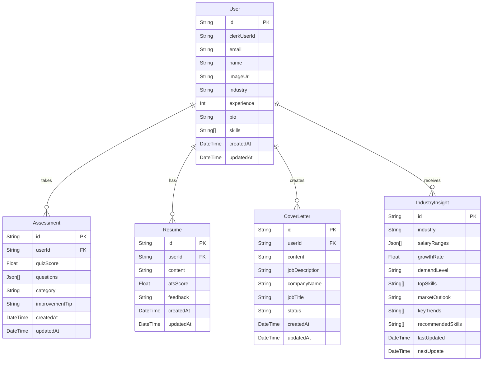

# Database Schema Documentation

## Overview

The AI Career Coach application uses PostgreSQL as its primary database with Prisma as the ORM. This document describes the database schema and relationships between entities.

## Entity Relationship Diagram



## Tables

### User

The User table stores information about registered users.

| Column | Type | Constraints | Description |
|--------|------|-------------|-------------|
| id | String | Primary Key | Unique identifier |
| clerkUserId | String | Unique | Clerk authentication ID |
| email | String | Required, Unique | User's email address |
| name | String | Nullable | User's full name |
| imageUrl | String | Nullable | URL to user's avatar |
| industry | String | Nullable | User's industry and specialization |
| experience | Int | Nullable | Years of professional experience |
| bio | String | Nullable | Professional biography |
| skills | String[] | Nullable | Array of user's skills |
| createdAt | DateTime | Required | Record creation timestamp |
| updatedAt | DateTime | Required | Record last update timestamp |

### Assessment

The Assessment table stores interview practice sessions and quiz results.

| Column | Type | Constraints | Description |
|--------|------|-------------|-------------|
| id | String | Primary Key | Unique identifier |
| userId | String | Foreign Key | Reference to User.id |
| quizScore | Float | Required | Overall quiz score (0-100) |
| questions | Json[] | Required | Array of questions with answers and metadata |
| category | String | Required | Category/Topic of the assessment |
| improvementTip | String | Nullable | AI-generated improvement tip |
| createdAt | DateTime | Required | Record creation timestamp |
| updatedAt | DateTime | Required | Record last update timestamp |

### Resume

The Resume table stores user-generated resume content.

| Column | Type | Constraints | Description |
|--------|------|-------------|-------------|
| id | String | Primary Key | Unique identifier |
| userId | String | Foreign Key, Unique | Reference to User.id |
| content | String | Nullable | Markdown content of the resume |
| atsScore | Float | Nullable | ATS compatibility score |
| feedback | String | Nullable | AI-generated feedback |
| createdAt | DateTime | Required | Record creation timestamp |
| updatedAt | DateTime | Required | Record last update timestamp |

### CoverLetter

The CoverLetter table stores generated cover letters.

| Column | Type | Constraints | Description |
|--------|------|-------------|-------------|
| id | String | Primary Key | Unique identifier |
| userId | String | Foreign Key | Reference to User.id |
| content | String | Required | Generated cover letter content |
| jobDescription | String | Nullable | Job description used for generation |
| companyName | String | Required | Target company name |
| jobTitle | String | Required | Target job title |
| status | String | Required, Default: "draft" | Cover letter status (draft/completed) |
| createdAt | DateTime | Required | Record creation timestamp |
| updatedAt | DateTime | Required | Record last update timestamp |

### IndustryInsight

The IndustryInsight table stores AI-generated insights for industries.

| Column | Type | Constraints | Description |
|--------|------|-------------|-------------|
| id | String | Primary Key | Unique identifier |
| industry | String | Unique | Industry identifier |
| salaryRanges | Json[] | Nullable | Array of salary data by role and location |
| growthRate | Float | Required | Industry growth rate |
| demandLevel | String | Required | Job market demand level |
| topSkills | String[] | Required | Array of in-demand skills |
| marketOutlook | String | Required | Market outlook assessment |
| keyTrends | String[] | Required | Array of key industry trends |
| recommendedSkills | String[] | Required | Array of recommended skills |
| lastUpdated | DateTime | Required | Last update timestamp |
| nextUpdate | DateTime | Required | Scheduled next update time |

## Indexes

### User
- Primary Key: `id`
- Unique: `clerkUserId`
- Unique: `email`
- Index: `userId` (for Assessment relation)

### Assessment
- Primary Key: `id`
- Index: `userId`

### Resume
- Primary Key: `id`
- Unique: `userId`
- Index: `userId`

### CoverLetter
- Primary Key: `id`
- Index: `userId`

### IndustryInsight
- Primary Key: `id`
- Unique: `industry`
- Index: `industry`

## Relationships

1. **User → Assessment**: One-to-many relationship. Each user can have multiple assessments.
2. **User → Resume**: One-to-one relationship. Each user has one resume.
3. **User → CoverLetter**: One-to-many relationship. Each user can create multiple cover letters.
4. **User → IndustryInsight**: Many-to-one relationship through the `industry` field in User table.

## Migrations

Database schema changes are managed through Prisma migrations. To create a new migration:

```bash
npx prisma migrate dev --name migration_name
```

To apply migrations in production:

```bash
npx prisma migrate deploy
```

## Backup and Recovery

Regular database backups are recommended. For PostgreSQL, you can use:

```bash
pg_dump -h hostname -U username database_name > backup.sql
```

To restore:

```bash
psql -h hostname -U username database_name < backup.sql
```

## Performance Considerations

1. **Indexing**: All foreign keys and frequently queried columns are indexed.
2. **Query Optimization**: Complex queries should use proper JOINs and WHERE clauses.
3. **Connection Pooling**: Use connection pooling in production environments.
4. **Caching**: Frequently accessed data should be cached at the application level.

## Security

1. **Data Encryption**: Sensitive data should be encrypted at rest.
2. **Access Control**: Database access should be restricted to application servers only.
3. **Audit Logs**: Maintain logs of all database operations for security monitoring.
4. **Regular Updates**: Keep PostgreSQL and Prisma updated with security patches.

## Monitoring

Key metrics to monitor:
- Query performance
- Connection pool usage
- Disk space utilization
- Backup success rates
- Error rates in database operations

## Troubleshooting

Common issues and solutions:

1. **Connection timeouts**: Increase connection timeout settings in Prisma configuration.
2. **Slow queries**: Use `EXPLAIN ANALYZE` to identify performance bottlenecks.
3. **Deadlocks**: Review transaction logic and ensure consistent lock ordering.
4. **Disk space**: Monitor disk usage and archive old data if necessary.

## Schema Evolution

When modifying the schema:
1. Always create a migration before making changes.
2. Test migrations in a staging environment first.
3. Ensure backward compatibility when possible.
4. Update the documentation to reflect schema changes.